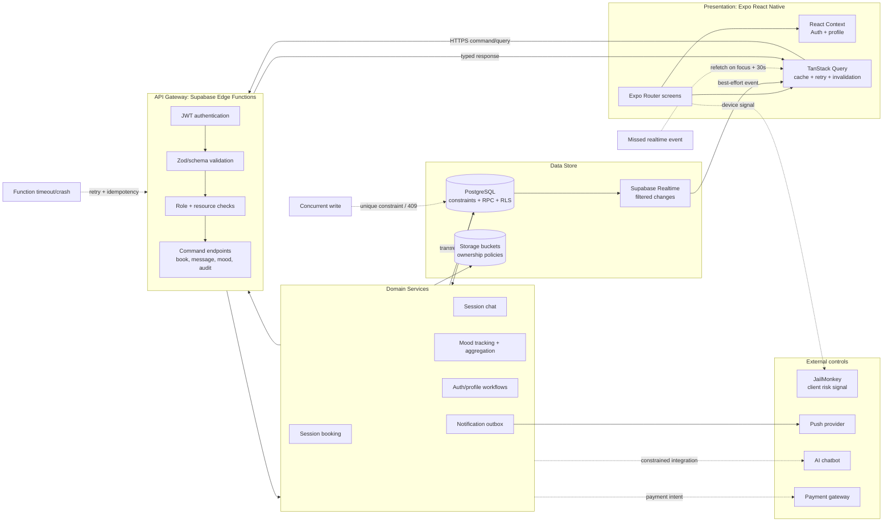
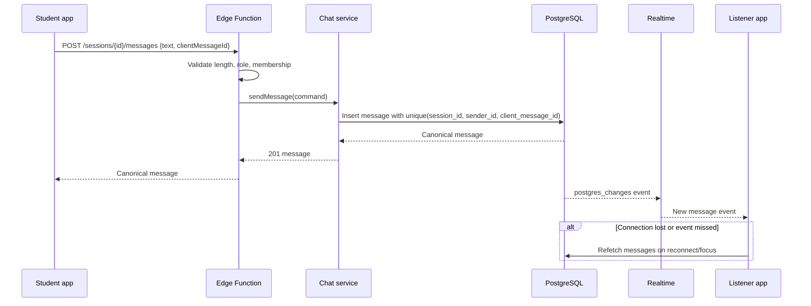

# Calm Spaces System Architecture

**Status:** Proposed target architecture for the production React Native app
**Scope:** Client, Supabase Edge Functions, PostgreSQL/RLS, Storage, realtime, and operational recovery
**Audience:** Maintainers fixing production defects and adding features without weakening privacy boundaries

> This is a target blueprint, not a claim that every table already exists in production. The current app uses `public.profiles.type`, `expert_peer_slots`, and several direct Supabase realtime channels. Migrations should map those names to the canonical model below incrementally.

## 1. Architecture Decision Record

### Context

Calm Spaces has three materially different trust levels: Student, Peer Listener, and Expert. It also handles private mood data, session conversations, push notifications, Storage objects, and realtime updates. The mobile client is untrusted: role values, IDs, cached queries, and retry behavior can all be stale or tampered with. JailMonkey is useful as a client hardening signal, but it cannot enforce authorization.

The application is below the scale that requires independently deployable microservices, but it is large enough that direct client-to-table writes make authorization, retries, and concurrency difficult to reason about. Supabase provides the required managed primitives: Auth, PostgreSQL, RLS, Storage, Realtime, and Edge Functions.

### Options considered

| Option | Benefits | Costs / decision |
| --- | --- | --- |
| Direct client-to-Supabase tables | Smallest initial code footprint | Authorization and workflows spread across screens; easy to double-write or expose rows. Retain only for read queries with safe RLS and simple realtime feeds. |
| One monolithic backend | Centralized control and transactions | Adds a server to build, deploy, monitor, and secure; violates the no-separate-backend constraint. |
| Pure microservices | Independent scaling and ownership | Excessive operational complexity for fewer than 10K DAU; cross-service consistency becomes harder. |
| **Supabase gateway plus domain services** | Keeps managed platform; centralizes validation and audit; DB remains authoritative for atomic work | Requires explicit contracts, migrations, and coordination between functions and client retries. **Chosen.** |

### Decision

Use four logical layers:

1. **Presentation:** Expo Router screens, React Context for session/profile state, and TanStack Query for cache, invalidation, and retry policy.
2. **API gateway:** Supabase Edge Functions. Every command validates the request schema, authenticates the JWT, resolves the role from the database, checks resource authorization, and returns stable HTTP errors.
3. **Domain services:** TypeScript modules called by gateway handlers. They own auth workflows, booking, chat, mood tracking, notifications, and audit events. They do not read request UI state or make authorization decisions from client-supplied roles.
4. **Data layer:** PostgreSQL tables, constraints, transactions, RLS policies, RPCs, and Storage buckets with ownership policies. PostgreSQL is the final authority for authorization and consistency.

Commands use Edge Functions. Safe, read-only queries may use the Supabase client directly when RLS fully expresses the allowlist. Privileged operations use narrowly scoped `SECURITY DEFINER` RPCs or functions with fixed `search_path`, never a client-held service-role key.

### Trade-offs and consequences

- There is more coordination than in direct table access: API contracts, migrations, function deployment, and client error mapping must change together.
- The extra boundary makes failures observable and testable. Authorization, audit, idempotency, and transaction semantics have one obvious owner.
- PostgreSQL constraints and transactions prevent races even if two Edge Functions run concurrently.
- Realtime remains a delivery optimization, not the source of truth. A reconnect or missed event always falls back to a query.
- Deployments become harder to do carelessly: migrations are ordered, functions are versioned, and staging must exercise real RLS.

## 2. Logical Component Diagram



### Flow and failure rules

- Normal request: client -> Edge Function -> domain service -> transaction/RPC -> PostgreSQL -> service -> function -> client.
- An Edge Function crash before commit rolls back the PostgreSQL transaction. A crash after commit but before the response is an **unknown outcome**; the client retries with the same idempotency key and the server returns the existing result.
- A booking collision is rejected by a unique constraint, translated to `409 SLOT_ALREADY_BOOKED`, and never repaired by a client-side availability guess.
- Realtime events can be duplicated, delayed, or missed. Handlers must be idempotent, and TanStack Query must refetch on focus/reconnect and on a 30-second staleness timer.
- JailMonkey can block or warn on a high-risk device, but server authorization and RLS must behave identically without it.

## 3. RBAC Strategy

The gateway resolves the role from `profiles.type` or a server-side role claim and compares it to the database record. A request body such as `role: "EXPERT"` is never trusted. RLS policies use `auth.uid()` and relationship tables; service-role access is limited to server-side code and is audited.

| Role | Read allowlist | Write allowlist | Gateway enforcement | RLS / database enforcement |
| --- | --- | --- | --- | --- |
| Student | Own profile; own sessions; participants and messages for own sessions; own moods; published resources; public community content | Book/cancel own sessions; send messages in own sessions; create own moods; edit own profile; create own community posts | JWT role is Student; every submitted student ID equals `auth.uid()`; session membership checked | `auth.uid() = student_id` for private rows; message policy requires session membership; resource policy requires `published = true` |
| Peer Listener | Own profile/availability; assigned sessions; messages for assigned sessions; permitted student summaries; published resources | Update own availability; accept/manage assigned sessions; add session notes; send session messages | JWT role is Peer; listener owns the slot/session; note fields and status transitions are allowlisted | `auth.uid() = listener_id`; notes require assigned session; availability writes require owner |
| Expert | Own profile; approved anonymized mood/session summaries; published resources; explicitly assigned cases; audit records for own actions | Create/update resources; approve Peer Listener records; perform audited case review/correction; send permitted messages | JWT role is Expert; purpose/case scope required for private student access; every access gets an audit event | No blanket client-facing bypass. Use a narrowly scoped `SECURITY DEFINER` function that returns minimum fields and inserts an audit record atomically |

### Validation placement

- **Gateway:** reject malformed JSON, unknown fields, invalid enums, oversized messages, invalid score ranges, missing idempotency keys, wrong role, and obviously unauthorized resource IDs early. This improves latency and error messages but is not a security boundary by itself.
- **Database:** enforce foreign keys, `CHECK` constraints, unique constraints, state transitions, ownership predicates, and atomic multi-row changes. This is the final defense against races and bypasses.
- **Domain service:** express policy that spans multiple records, then call one database transaction/RPC. Do not split a check and write into separate network round trips.

## 4. Critical Workflow Sequences

### Flow A: Student books a session

```mermaid
sequenceDiagram
  participant S as Student app
  participant G as Edge Function
  participant B as Booking service
  participant DB as PostgreSQL RPC
  participant Q as Notification outbox
  participant L as Listener app
  S->>G: POST /sessions/book {listenerId, slotId, idempotencyKey}
  G->>G: Validate JWT, role, schema, ownership
  G->>B: bookSession(command)
  B->>DB: book_session(...) in transaction
  DB->>DB: Lock slot; check availability and eligibility
  DB->>DB: Insert session + consume slot + outbox row
  alt First request
    DB-->>B: session id + calendar details
  else Same idempotency key
    DB-->>B: Existing session result
  else Another student won the race
    DB-->>B: Unique violation
  end
  B->>Q: Commit notification job with session id
  B-->>G: 201 or 409 SLOT_ALREADY_BOOKED
  G-->>S: Session details or conflict
  Q-->>L: Push notification (retryable, outside booking transaction)
```

Two students can pass the gateway check simultaneously. They cannot both commit: `slot_id` has a unique active-booking constraint and the RPC performs the check and insert atomically. The second response is a deterministic `409`, not a generic 500.

### Flow B: Peer Listener and Student chat



Only session members may insert or read messages. The client message ID makes a timeout retry return the original row rather than creating a duplicate. Realtime subscriptions are suitable below the current scale because PostgreSQL remains authoritative, but channel count and fan-out must be monitored. Move to a dedicated websocket gateway only if measured fan-out, latency, or connection limits justify the operational cost.

### Flow C: Mood entry and aggregation

```mermaid
sequenceDiagram
  participant S as Student app
  participant G as Edge Function
  participant M as Mood service
  participant DB as PostgreSQL
  participant W as Aggregation worker/function
  participant E as Expert dashboard
  S->>G: POST /moods {score, tags, idempotencyKey}
  G->>G: Validate role, score 0..10, approved tags
  G->>M: recordMood(command)
  M->>DB: Insert mood + outbox aggregation job in one transaction
  DB-->>M: Mood ID and created_at
  M-->>G: 201 accepted
  G-->>S: Mood ID
  W->>DB: Recompute summary from source moods
  E->>DB: Read summary with freshness metadata
  alt Worker delayed
    E-->>E: Show last summary and updated_at; retry/invalidate later
  end
```

Mood creation is strongly consistent; the summary is intentionally eventually consistent. Store `summary_updated_at` and expose it so Expert dashboards never imply that a stale aggregate is current. Recomputing from source moods, rather than incrementing a counter blindly, makes retries safe.

## 5. Canonical SQL Schema

This is a reference migration. Apply it in staging after mapping existing `profiles`, `expert_peer_slots`, booking, and message tables. Use UUIDs generated by PostgreSQL and keep `auth.users` managed by Supabase.

```sql
create type public.app_role as enum ('STUDENT', 'PEER', 'EXPERT');
create type public.session_status as enum ('BOOKED', 'CONFIRMED', 'COMPLETED', 'CANCELLED');

create table public.profiles (
  id uuid primary key references auth.users(id) on delete cascade,
  type public.app_role not null default 'STUDENT',
  display_name text,
  created_at timestamptz not null default now()
);

create table public.students (
  id uuid primary key references public.profiles(id) on delete cascade
);

create table public.peer_listeners (
  id uuid primary key references public.profiles(id) on delete cascade,
  certifications jsonb not null default '[]'::jsonb,
  approved_at timestamptz
);

create table public.experts (
  id uuid primary key references public.profiles(id) on delete cascade,
  specialties text[] not null default '{}',
  license_verified boolean not null default false
);

create table public.listener_slots (
  id uuid primary key default gen_random_uuid(),
  listener_id uuid not null references public.peer_listeners(id),
  starts_at timestamptz not null,
  ends_at timestamptz not null,
  is_available boolean not null default true,
  check (ends_at > starts_at),
  unique (listener_id, starts_at, ends_at)
);

create table public.sessions (
  id uuid primary key default gen_random_uuid(),
  student_id uuid not null references public.students(id),
  listener_id uuid not null references public.peer_listeners(id),
  slot_id uuid not null references public.listener_slots(id),
  idempotency_key text not null,
  status public.session_status not null default 'BOOKED',
  created_at timestamptz not null default now()
);

create unique index sessions_slot_active_uniq
  on public.sessions(slot_id)
  where status in ('BOOKED', 'CONFIRMED');
create unique index sessions_student_idempotency_uniq
  on public.sessions(student_id, idempotency_key);

create table public.messages (
  id uuid primary key default gen_random_uuid(),
  session_id uuid not null references public.sessions(id) on delete cascade,
  user_id uuid not null references public.profiles(id),
  client_message_id text not null,
  text text not null check (char_length(text) between 1 and 4000),
  created_at timestamptz not null default now(),
  unique (session_id, user_id, client_message_id)
);

create table public.moods (
  id uuid primary key default gen_random_uuid(),
  student_id uuid not null references public.students(id) on delete cascade,
  score numeric(3,1) not null check (score >= 0 and score <= 10),
  tags text[] not null default '{}',
  created_at timestamptz not null default now(),
  idempotency_key text not null,
  unique (student_id, idempotency_key)
);

create table public.resources (
  id uuid primary key default gen_random_uuid(),
  type text not null check (type in ('article', 'audio', 'video')),
  content_url text not null,
  expert_id uuid not null references public.experts(id),
  published boolean not null default false,
  created_at timestamptz not null default now()
);

create table public.audit_log (
  id bigint generated always as identity primary key,
  actor_id uuid not null references public.profiles(id),
  action text not null,
  resource_type text not null,
  resource_id uuid,
  purpose text,
  metadata jsonb not null default '{}'::jsonb,
  created_at timestamptz not null default now()
);

create table public.outbox_events (
  id uuid primary key default gen_random_uuid(),
  event_type text not null,
  aggregate_id uuid not null,
  payload jsonb not null,
  processed_at timestamptz,
  attempts integer not null default 0,
  created_at timestamptz not null default now()
);

create index sessions_student_created_idx on public.sessions(student_id, created_at desc);
create index sessions_listener_created_idx on public.sessions(listener_id, created_at desc);
create index messages_session_created_idx on public.messages(session_id, created_at);
create index moods_student_created_idx on public.moods(student_id, created_at desc);
create index audit_actor_created_idx on public.audit_log(actor_id, created_at desc);
create index outbox_unprocessed_idx on public.outbox_events(created_at) where processed_at is null;
```

The requested `UNIQUE (listener_id, slot_id, created_at)` is insufficient because a different timestamp permits a second booking. The partial unique index on active `slot_id` is the race-prevention constraint. The booking RPC must lock the slot, validate that the listener owns it, insert the session, mark the slot unavailable, and insert the notification outbox row in one transaction.

For every private table, enable RLS and add explicit policies for the allowlist. Test both positive and negative paths with real JWTs. Expert access should be an audited function such as `expert_get_case_summary(case_id, purpose)` that returns only approved fields and writes `audit_log` in the same transaction.

## 6. Deployment and Testing Strategy

### Environments

1. **Local:** `npm run dev`; use seeded mock Student, Peer, and Expert accounts and a local/staging Supabase project. Exercise every command through its Edge Function.
2. **Staging:** `npx eas build --platform android --profile staging`; use real Auth, RLS, Storage, Realtime, push credentials, and failure injection.
3. **Production:** `npx eas build --platform android --profile production`; run smoke tests against production-safe accounts, then promote through Play Store gradual rollout: 10%, 25%, 100%.

### Required automated and manual checks

- Unit-test schema validation, error mapping, retry/idempotency behavior, and role guards.
- Integration-test every RLS allow and deny path with three real roles; include a Student attempting another Student's ID and an Expert attempting unassigned raw rows.
- Race-test two concurrent bookings for one slot: exactly one succeeds, one returns `409`, and only one notification is emitted.
- Retry a booking, message, and mood request after an artificial timeout; assert one row and one logical result.
- Kill or time out an Edge Function before and after commit; verify rollback versus idempotent lookup behavior.
- Disconnect and reconnect realtime; verify unsubscribe cleanup, no duplicate handlers, and query refetch on focus/reconnect/30-second staleness.
- Validate Storage paths, MIME/size limits, owner reads, and cross-user download denial.
- Verify audit records for Expert reads, writes, exports, and corrections; ensure purpose and target resource are present.
- Run `npm run lint` and `npm test`, then build the staging Android artifact with the exact EAS profile used for release.
- Monitor Edge Function latency/error rate by endpoint, 401/403/409/5xx counts, RLS policy violations, outbox backlog, realtime reconnects, and summary freshness.
- Confirm crash reporting contains request/correlation IDs but never message text, mood tags, access tokens, or raw private payloads.

## 7. Fallback and Recovery Runbook

| Failure | Required behavior |
| --- | --- |
| Edge Function timeout | Retry up to 3 times with exponential backoff and the same idempotency key. If the result remains unknown, query by key before showing failure. Display a short retry message, not a duplicate action. |
| Double-write collision | PostgreSQL constraint wins. Map the error to `409 SLOT_ALREADY_BOOKED` or return the existing idempotent row. Refresh availability. |
| Stale realtime subscription | Remove old channel on unmount or identity change; refetch on focus/reconnect and every 30 seconds while active. Never mutate cache from an event without deduplication. |
| Aggregation delay | Show `summary_updated_at` and retain the prior summary. Retry the outbox worker; do not fabricate a current value. |
| Session corruption | Preserve original rows, create an audited correction event, and restrict manual repair to authorized Experts/admin tooling. Never silently overwrite history. |
| Push notification failure | Booking remains committed. Retry the outbox event with backoff and show the session in both clients on next refresh. |

## 8. Answers to the Design Questions

1. **Validation:** Do cheap shape and role checks at the gateway, but enforce security, invariants, and atomicity in PostgreSQL. Gateway validation is ergonomics; RLS and constraints are the security boundary.
2. **Double booking:** Use a transaction plus a partial unique index on the active slot. Translate the losing insert into a 409 and refresh the client.
3. **Realtime scalability:** Supabase subscriptions are appropriate at the current scale when scoped to session membership and treated as best-effort delivery. Measure connection/fan-out limits before considering a websocket service; do not switch preemptively.
4. **Expert audit:** Require a server-side, purpose-bound function for private access. Insert `actor_id`, action, resource, purpose, timestamp, and correlation metadata into `audit_log` atomically with the read authorization decision.
5. **Function crash mid-transaction:** PostgreSQL rolls back uncommitted work. If the function crashes after commit but before returning, the client sees an unknown outcome; idempotency keys and lookup-by-key make retry safe. External push/AI/payment calls belong in an outbox or compensating workflow, not inside the database transaction.